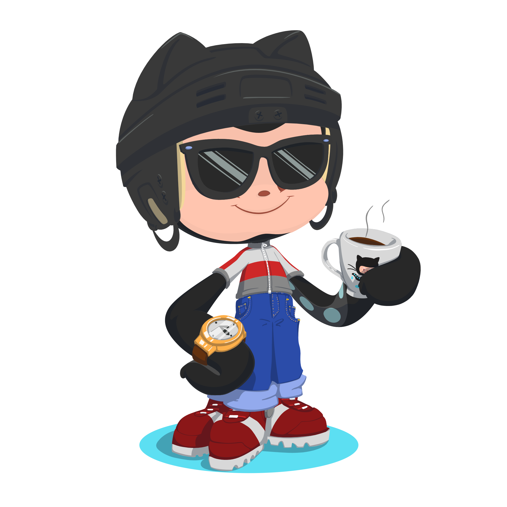

# <a href="https://www.linkedin.com/in/mohammed-mahmod/" target="_blank">Mohamed Mahmoud</a>

    

    

    
    

# Forkify , In forkify project you can search about any recipe, can add your favorite recipes to
bookmarks and can add a recipe to share it with others

- [ Live Link ](https://forkify-app-beta.vercel.app/).

<h1 align="center">:wave: Thanks For Reading :wave:</h1>
